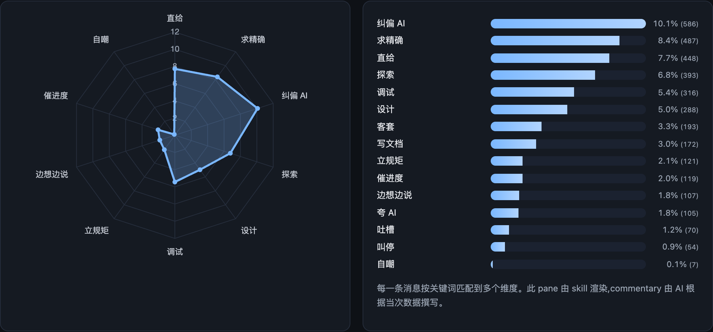
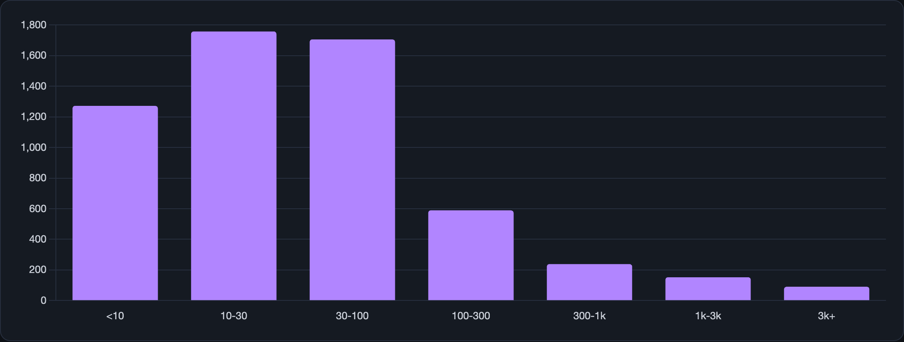

# me-talk

> A Claude Code / OpenCode **skill** that turns your chat history with AI coding
> assistants into a quantitative, data-backed portrait of *how* you talk to AI.

---

## 🤖 If you are an AI / code agent — start here

You are about to use `me-talk`. The canonical entry point is
[`SKILL.md`](./SKILL.md); this section is the 30-second version so you can
decide whether to load it.

### What this skill does

Harvests user messages from 5 AI coding tools' local storage, aggregates them
into trait statistics, and renders a single-page HTML dashboard plus an
AI-written narrative portrait.

### The 4-step pipeline

Run in order. Each step is a single command; the portrait step is where **you**
do work.

```bash
# 1. extract (reads ~/.claude, ~/Library/..., etc; writes ./raw/)
python3 {SKILL}/scripts/extract.py --output .

# 2. aggregate (reads ./raw/, writes ./analysis/stats.json)
python3 {SKILL}/scripts/analyze.py --output .

# 3. write the portrait  ← YOUR job
#    Read ./analysis/stats.json, sample ./raw/*/messages.jsonl (≥50 rows),
#    then produce the files below following references/portrait-template.md:
#      analysis/portrait.md       (8 sections, ~1000-1500 字)
#      analysis/tldr.md           (2-4 sentences)
#      analysis/quotes.json       ([{"text":"...", "tag":"..."}] × 8-12)
#    Optional: analysis/{trait,timeline,projects,words}_commentary.md

# 4. render (injects your .md into the template, writes ./index.html)
python3 {SKILL}/scripts/render.py --output .
```

`{SKILL}` resolves to `~/.claude/skills/me-talk` under Claude Code, or
`~/.agents/skills/me-talk` under OpenCode. Run from the user's current working
directory — outputs always land in `$CWD`.

### Hard rules for the portrait (step 3)

These exist to stop the portrait from becoming LinkedIn fluff. Skipping them
defeats the skill.

1. **Every section must cite a number** from `stats.json` (percentage with one
   decimal, or raw count).
2. **Every section must embed a verbatim quote** from `raw/*/messages.jsonl`.
   Copy the exact text — do not paraphrase, do not translate.
3. **No value judgements.** Describe patterns ("politeness words appear 3
   times total"), don't grade them ("you should be more polite").
4. **No opening filler.** Don't write "综上所述" / "From the data we can see"
   — go straight to the observation.
5. **Check self-consistency.** If the user has a `CLAUDE.md` or `AGENTS.md`
   declaring explicit rules ("don't write comments"), compare them against
   actual behaviour in the data. Mismatches or matches are the best material.

Full rules: [`references/portrait-template.md`](./references/portrait-template.md).

### Trigger phrases

English: *"analyse how I talk to AI"*, *"give me a portrait from my chat
history"*, *"what does my AI chat reveal about me"*.

Chinese: *"根据我和 AI 的聊天记录分析我的性格"*, *"我跟 AI 的说话风格画像"*,
*"把我的 AI 聊天记录汇总一下"*.

### What NOT to do

- **Don't skip step 1–2.** The portrait depends on `stats.json` + actual
  quotes; without the pipeline you'll hallucinate numbers.
- **Don't write the portrait from memory.** Always read at least 50 rows from
  `raw/*/messages.jsonl` — especially `notable_quotes` in `stats.json`.
- **Don't touch raw data manually.** The extractors handle redaction of
  `sk-*`, `Bearer *`, etc. Don't add "privacy-preserving" transforms; the user
  opted in to seeing their own paths and project names.
- **Don't commit any output.** The skill's `.gitignore` excludes `raw/`,
  `analysis/`, `index.html`. If the user wants to persist, they'll handle it.

---

## 🧑 If you are a human — read on

### What it shows

- **KPI row** — total messages, days with data, tools used, average message length
- **Trait radar + bar chart** — directness, correction, precision requests,
  explore / design / debug modes, meta-rules, etc.
- **Time rhythm** — by hour, weekday, and date
- **Tool mix** — which AI assistant you actually lean on
- **Projects** — top directories the conversations happened in
- **Word clouds** — Chinese bigrams + English words
- **Length histogram** — how verbose each message tends to be
- **Quotes + full portrait** — AI-written, grounded in the numbers



### Supported tools

| Tool | Source of truth |
|---|---|
| `claude-code` | `~/.claude/projects/*/*.jsonl` |
| `opencode`    | `~/.local/share/opencode/storage/{session,message,part}/` |
| `kiro-cli`    | `~/Library/Application Support/kiro-cli/data.sqlite3` |
| `kiro-gui`    | `~/Library/Application Support/Kiro/User/globalStorage/kiro.kiroagent/*.chat` |
| `trae`        | `~/Library/Application Support/Trae/User/workspaceStorage/*/state.vscdb` |

Paths are macOS-style. Linux/Windows paths haven't been tested yet.

### Install

Clone into the skills directory your agent reads:

```bash
# Claude Code
git clone https://github.com/W-Mai/me-talk ~/.claude/skills/me-talk

# OpenCode
git clone https://github.com/W-Mai/me-talk ~/.agents/skills/me-talk
```

Or symlink one checkout into both:

```bash
git clone https://github.com/W-Mai/me-talk ~/src/me-talk
ln -s ~/src/me-talk ~/.claude/skills/me-talk
ln -s ~/src/me-talk ~/.agents/skills/me-talk
```

Requires Python 3.10+. No third-party packages.

### Usage

Once installed, just ask your agent:

> 帮我分析一下我跟 AI 的聊天记录 / analyse how I talk to Claude

The agent reads `SKILL.md` and drives the pipeline. To run manually, follow the
4 commands in the "If you are an AI" section above — they're the same commands
an agent would run.

### Output layout

```
./raw/<tool>/messages.jsonl     # normalised user turns + nearest AI context
./raw/<tool>/stats.json         # per-tool row count + date range
./analysis/stats.json           # aggregated traits, timeline, word frequencies
./analysis/portrait.md          # full narrative portrait (AI-written)
./analysis/tldr.md              # one-paragraph summary (AI-written)
./analysis/quotes.json          # curated punchy lines
./analysis/*_commentary.md      # inline notes next to charts (AI-written, optional)
./index.html                    # standalone dashboard
```



### Privacy

- All extraction and rendering runs **locally**.
- Light redaction covers `sk-*`, `Bearer *`, `access_token`, `ghp_*`, and
  common Slack / feishu token shapes. Paths, project names, and everything
  else are preserved — this is your private workspace.
- The skill repo itself contains **no user data**. Generated `raw/`,
  `analysis/`, and `index.html` are in `.gitignore` at the skill level.
- Screenshots in this README come from the author's real data — they expose
  high-level trait percentages (e.g. "8.7% correction"), not conversation
  content.

### Patterns are bilingual

The trait-detection regex dictionary covers **Chinese and English in
parallel**, so you get meaningful output whether you prompt in 中文, English,
or mix them freely. To extend: edit `PATTERNS` in `scripts/analyze.py`.

### Design notes

- **Stats are deterministic, portrait is AI-authored.** The same raw data
  always yields the same `stats.json`; the portrait is rewritten per run so it
  stays grounded in current numbers instead of a canned template.
- **Portrait has hard rules.** `references/portrait-template.md` enforces that
  every section cites a number, includes a verbatim quote, and avoids value
  judgements — that's how you stop it from turning into LinkedIn filler.
- **Kiro GUI gotcha.** The `.chat` files are full-session snapshots, not
  append-only logs, so the same turn appears in thousands of files. The
  extractor deduplicates on `(user_text[:300], session_id)` — expect a ~40×
  reduction from raw file count to final turn count.

### License

MIT — see [LICENSE](LICENSE).

---

## 中文帮助段

这是一个 Claude Code / OpenCode 的 skill,能够:

1. **抽取**你跟 5 种 AI 编程助手(Claude Code / OpenCode / Kiro CLI / Kiro GUI / Trae)
   本地留存的聊天记录中的用户发言
2. **聚合**出语气、工作模式、协作方式等多个维度的统计
3. **生成**一份由 AI 根据数字和原话现写的性格画像,附单页 HTML 可视化

用法:在 agent 里说「分析下我跟 AI 的聊天记录」或「根据聊天记录给我画像」即可触发。
agent 会按 `SKILL.md` 的四步流程跑完 extract → analyze → 写画像 → render。

关键词可以是中文也可以是英文,关键词字典两边都兼容。

**数据全部在本地处理,不会离开这台机器**。`.gitignore` 已经把 `raw/`、`analysis/`、
`index.html` 都挡住了,想把项目推到 GitHub 不用额外操心。
