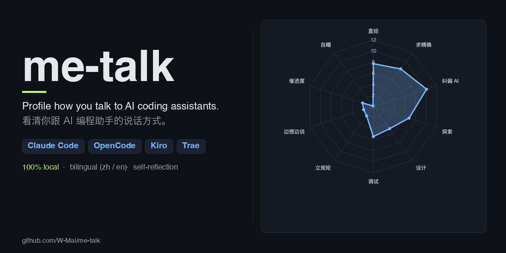

# me-talk



> **Claude Code / OpenCode skill**，读取你跟 **Claude Code、OpenCode、Kiro CLI、
> Kiro GUI、Trae** 这 5 种 AI 编程助手的本地聊天记录，聚合成量化统计，
> 再由 AI 现写一份带数据锚点的性格画像。100 % 本地处理、中英双语。
>
> [English](./README.md)

---

## 🤖 如果你是 AI / code agent

你正在使用 `me-talk`。正式入口是 [`SKILL.md`](./SKILL.md)，本段是 30 秒速览，
用来判断要不要把 SKILL.md 完整读入 context。

### 这个 skill 做什么

从 5 种 AI 编程工具的本地存储里抽取用户发言，聚合成各维度统计，产出一份单页
HTML 画像 + 一份 AI 撰写的文字性格分析。

### 四步流水线

按顺序跑，每步一条命令，第 3 步是你(AI)真正动笔的地方。

```bash
# 1. 抽取(读 ~/.claude、~/Library/... 等本地存储，写入 ./raw/)
python3 {SKILL}/scripts/extract.py --output .

# 2. 聚合(读 ./raw/，写入 ./analysis/stats.json)
python3 {SKILL}/scripts/analyze.py --output .

# 3. 写画像 ← 你的活
#    读 ./analysis/stats.json、抽样 ./raw/*/messages.jsonl(≥50 条),
#    按 references/portrait-template.md 的规范产出:
#      analysis/portrait.md       (8 小节，1000-1500 字)
#      analysis/tldr.md           (2-4 句)
#      analysis/quotes.json       ([{"text":"...", "tag":"..."}] × 8-12 条)
#    可选:analysis/{trait,timeline,projects,words}_commentary.md

# 4. 渲染(把你写的 .md 注入模板，输出 ./index.html)
python3 {SKILL}/scripts/render.py --output .
```

`{SKILL}` 在 Claude Code 下解析为 `~/.claude/skills/me-talk`，在 OpenCode 下是
`~/.agents/skills/me-talk`。在用户当前工作目录下跑，产物直接落在 `$CWD`。

### 第 3 步「写画像」的硬规则

这几条存在是为了不让画像变成 LinkedIn 式空话。跳过就等于白跑。

1. **每一节必须引一个来自 `stats.json` 的数字**(百分比保留一位小数，或原始计数)
2. **每一节必须嵌一句 `raw/*/messages.jsonl` 里的原话**——原样照抄，不改写、不翻译
3. **不给价值判断**。描述模式(「礼貌词共出现 3 次」)，别评分(「你应该更礼貌」)
4. **别写开场套话**。不要「综上所述」「从数据中可以看出」，直接给观察
5. **检查自洽性**。如果用户有 `CLAUDE.md` / `AGENTS.md`，里面写了「别写注释」
   这种明规则，对照 raw 里的实际行为，一致或反差都是画像里最有料的材料

完整规则见 [`references/portrait-template.md`](./references/portrait-template.md)。

### 触发关键词

中文:「根据我和 AI 的聊天记录分析我的性格」「我跟 AI 的说话风格画像」
「把我的 AI 聊天记录汇总一下」。

English: *"analyse how I talk to AI"*, *"give me a portrait from my chat
history"*, *"what does my AI chat reveal about me"*.

### 别干的事

- **别跳过 1-2 步**。画像依赖 `stats.json` + 原话引用，不跑 pipeline 就等于凭空编
- **别凭记忆写画像**。务必读至少 50 条 `raw/*/messages.jsonl`，特别注意
  `stats.json` 里的 `notable_quotes`
- **别在 raw 数据上手动脱敏**。extractor 已经处理了 `sk-*`、`Bearer *` 等
  token 类 secret。用户选择看自己的真实路径和项目名，别越界
- **别提交任何产物**。skill 的 `.gitignore` 已经排除了 `raw/`、`analysis/`、
  `index.html`。用户想持久化自己来

---

## 🧑 如果你是人

### 能看到什么

- **KPI 行**——总消息数、有数据的天数、使用的工具数、平均消息长度
- **维度雷达图 + 条形图**——直给、纠偏、求精确、探索/设计/调试模式、立规矩等
- **时间节律**——按小时、星期、日期
- **工具分布**——哪个 AI 助手被用得最多
- **项目分布**——对话发生在哪些代码目录
- **词云**——中文二元词 + 英文单词
- **长度直方图**——每条消息有多啰嗦
- **金句 + 完整画像**——AI 撰写，有数据锚点


### 支持的工具

| 工具 | 存储位置 |
|---|---|
| `claude-code` | `~/.claude/projects/*/*.jsonl` |
| `opencode`    | `~/.local/share/opencode/storage/{session,message,part}/` |
| `kiro-cli`    | `~/Library/Application Support/kiro-cli/data.sqlite3` |
| `kiro-gui`    | `~/Library/Application Support/Kiro/User/globalStorage/kiro.kiroagent/*.chat` |
| `trae`        | `~/Library/Application Support/Trae/User/workspaceStorage/*/state.vscdb` |

路径都是 macOS 风格，Linux / Windows 还没测过 —— 如果你是 code agent 跑在别的系统上，可以自行探测对应位置、顺手把 extractor 改好。

### 安装

克隆到你的 agent 识别的 skills 目录:

```bash
# Claude Code
git clone https://github.com/W-Mai/me-talk ~/.claude/skills/me-talk

# OpenCode
git clone https://github.com/W-Mai/me-talk ~/.agents/skills/me-talk
```

或者一份代码 symlink 到两边:

```bash
git clone https://github.com/W-Mai/me-talk ~/src/me-talk
ln -s ~/src/me-talk ~/.claude/skills/me-talk
ln -s ~/src/me-talk ~/.agents/skills/me-talk
```

需要 Python 3.10+，无第三方依赖。

### 用法

装完之后直接问 agent:

> 帮我分析一下我跟 AI 的聊天记录

agent 读 `SKILL.md` 驱动 pipeline。想手动跑的话，照上面 AI 段里那 4 条命令
依次敲就行——agent 跑的也是同样的命令。

### 产物布局

```
./raw/<tool>/messages.jsonl     # 归一化的用户发言 + 最近的 AI 上下文
./raw/<tool>/stats.json         # 每个工具的条数和时间跨度
./analysis/stats.json           # 聚合后的维度统计、时间线、词频
./analysis/portrait.md          # 完整画像(AI 写)
./analysis/tldr.md              # 一句话画像(AI 写)
./analysis/quotes.json          # 精选金句
./analysis/*_commentary.md      # 图旁的短注(AI 写，可选)
./index.html                    # 独立的 HTML 看板
```


### 隐私

- 所有抽取和渲染都在**本地**跑
- 轻度脱敏覆盖 `sk-*`、`Bearer *`、`access_token`、`ghp_*`、
  Slack / feishu token 格式。路径、项目名和其他内容**保留**——这是你的私人工作区
- skill 仓库本身**不含用户数据**。生成的 `raw/`、`analysis/`、`index.html` 都在
  skill 的 `.gitignore` 里挡住
- README 里的截图来自作者真实数据——暴露的是高层级维度百分比
  (比如「纠偏 8.7%」)，不包含对话内容

### 双语支持

维度识别的正则字典**中英平行**，无论你用中文 prompt、英文 prompt 还是混着用，
都能匹配到有意义的结果。想扩展语言？改 `scripts/analyze.py` 里的 `PATTERNS`。

### 设计笔记

- **统计是确定的，画像是 AI 现写的**。同一份原始数据，`stats.json` 永远一样；
  画像每次重写，确保贴合当前数字，而不是套模板
- **画像有硬规则**。`references/portrait-template.md` 规定每一节必须引数字、
  必须嵌原话、不给价值判断——这是挡住 LinkedIn 式套话的核心
- **Kiro GUI 的坑**。`.chat` 文件是整个 session 的快照而不是追加日志，
  所以同一轮对话会在几千个文件里重复出现。extractor 用
  `(user_text[:300], session_id)` 去重——原始文件数到最终用户发言数通常
  会有 ~40× 的压缩比

### License

MIT，见 [LICENSE](LICENSE)。
